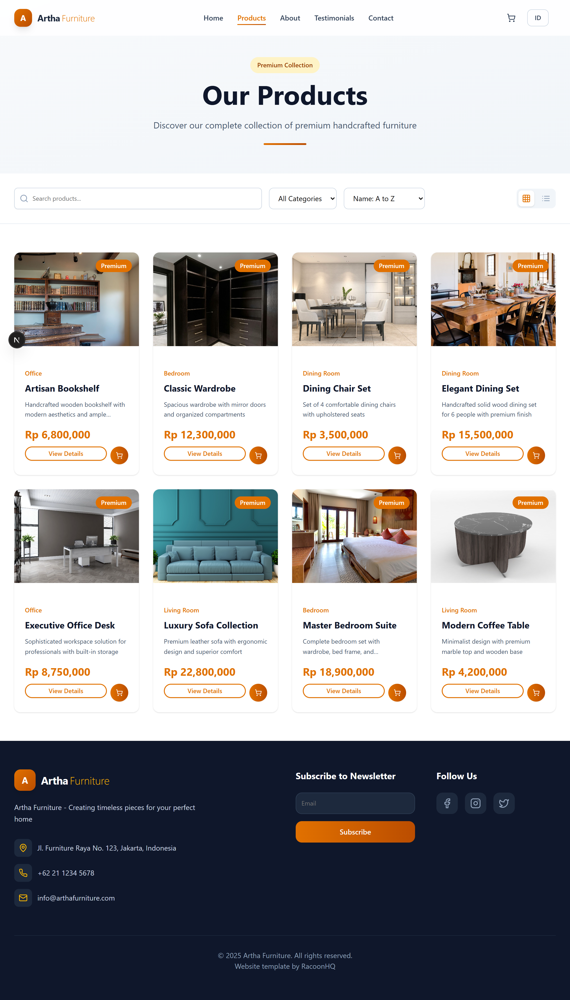
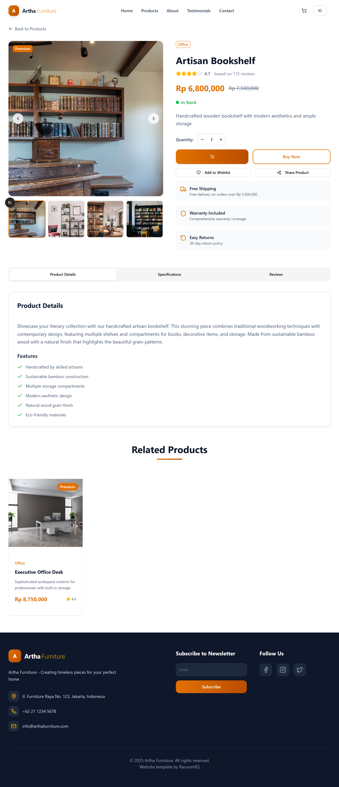
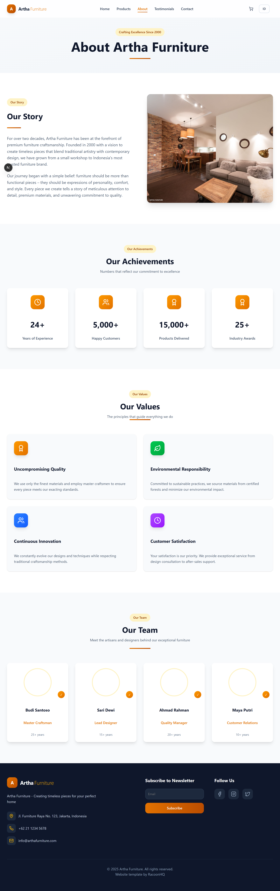
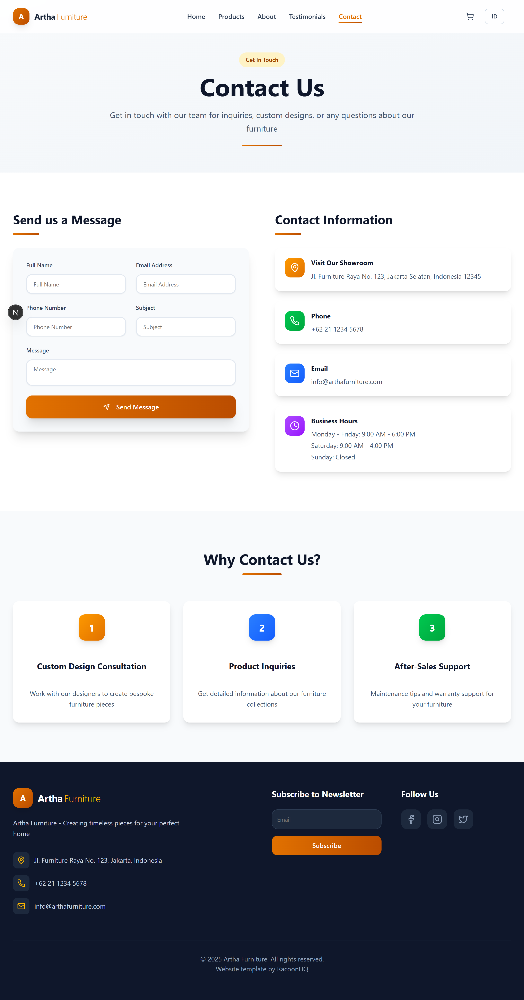

# Artha Furniture - Modern Furniture E-commerce

 *[Add your screenshot here]*

A modern, responsive furniture e-commerce website built with Next.js, TypeScript, and Tailwind CSS. This project showcases a clean, user-friendly interface for browsing and purchasing high-quality furniture items.

## 🚀 Features

- **Modern UI/UX** - Sleek, responsive design that works on all devices
- **Product Catalog** - Beautifully displayed furniture collections with categories
- **Product Details** - Detailed product pages with image galleries and specifications
- **Shopping Cart** - Intuitive cart management system
- **Responsive Design** - Fully responsive layout for desktop, tablet, and mobile
- **Performance Optimized** - Built with Next.js for optimal performance and SEO
- **Type Safety** - TypeScript integration for better developer experience

## 🛠️ Technologies Used

- **Frontend Framework**: Next.js 14
- **Styling**: Tailwind CSS
- **Type Safety**: TypeScript
- **UI Components**: Shadcn/ui
- **Form Handling**: React Hook Form
- **Icons**: Lucide Icons
- **Animation**: Framer Motion

## 📸 Screenshots

| Home Page | Products Page | Product Detail | About |
|-----------|---------------|----------------|-------|
|  |  |  |  |

| Contact | Testimonial |
|---------|-------------|
|  |  |

## 🚀 Getting Started

### Prerequisites

- Node.js 18.0 or later
- npm or yarn or pnpm

### Installation

1. Clone the repository
   ```bash
   git clone https://github.com/yourusername/artha-furniture.git
   cd artha-furniture
   ```

2. Install dependencies
   ```bash
   npm install
   # or
   yarn
   # or
   pnpm install
   ```

3. Run the development server
   ```bash
   npm run dev
   # or
   yarn dev
   # or
   pnpm dev
   ```

4. Open [http://localhost:3000](http://localhost:3000) with your browser to see the result.

## 🔧 Environment Variables

Create a `.env.local` file in the root directory and add the following variables:

```env
NEXT_PUBLIC_API_URL=your_api_url_here
# Add other environment variables as needed
```

## 🛠️ Built With

- [Next.js](https://nextjs.org/) - The React Framework for Production
- [TypeScript](https://www.typescriptlang.org/) - TypeScript is a typed superset of JavaScript
- [Tailwind CSS](https://tailwindcss.com/) - A utility-first CSS framework
- [Shadcn/ui](https://ui.shadcn.com/) - Beautifully designed components

## 👥 Contributing

Contributions are what make the open-source community such an amazing place to learn, inspire, and create. Any contributions you make are **greatly appreciated**.

1. Fork the Project
2. Create your Feature Branch (`git checkout -b feature/AmazingFeature`)
3. Commit your Changes (`git commit -m 'Add some AmazingFeature'`)
4. Push to the Branch (`git push origin feature/AmazingFeature`)
5. Open a Pull Request

## 📄 License

Distributed under the MIT License. See `LICENSE` for more information.

## 👨‍💻 Developer

- **RaqoonHQ** - [GitHub](https://github.com/RaqoonHQ)

## 🙏 Acknowledgments

- [Next.js Documentation](https://nextjs.org/docs)
- [Tailwind CSS Documentation](https://tailwindcss.com/docs)
- [Shadcn/ui Documentation](https://ui.shadcn.com/docs)

---

Made by [Sayyid Abdullah Azzam] - Feel free to contact me!
